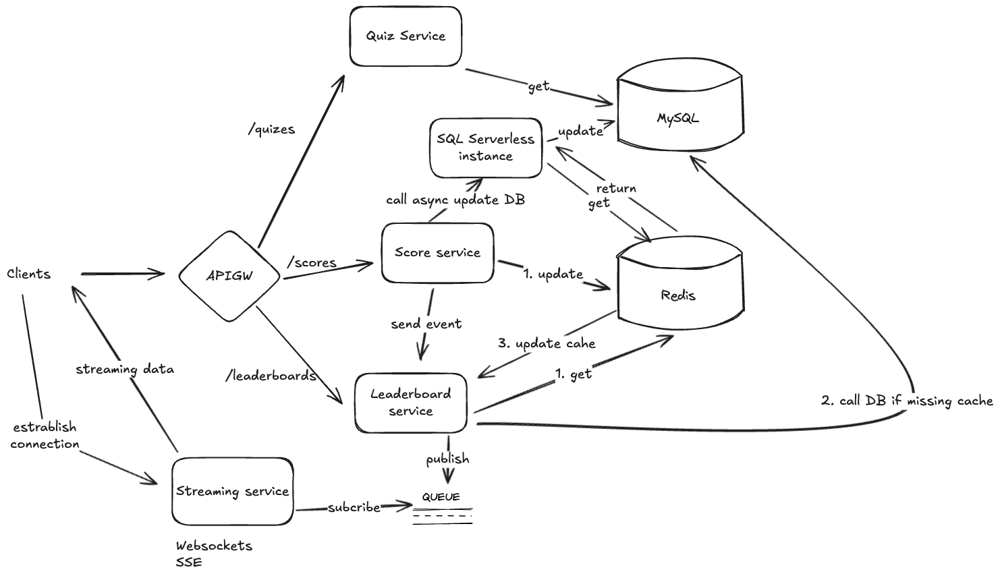

# System design documentation

## Overview

The system is designed to be a scalable and high-performance platform for a
quiz application. It is designed to handle a large number of concurrent users
and requests, allows the users to compete with each other for the top ranks.

## Back of the envelope estimation

- Assume the system will have 1M DAU and they play during 24 hours, so that
the amount of request per second is 1M / 24 / 3600 = 1200 RPS. But especially,
the number of requests per second will peak at the certain time, so let's assume
the peak number of requests per second will be 5 times the average number of
requests per second, which is 5 * 1200 = 6000 RPS.
- Assume, each score data stores in the database will be name and score, which
takes around 1KB. So that in case there is 1M users enrolls to the quiz, the
total amount of data the database needs to store is 1M * 1KB = 1TB per quiz.

## Architecture diagram

The architecture includes below components:
- Clients: The user interface of the system.
- API Gateway: The entry point for all requests to the system.
- Quiz Service: The backend service to handle all services related to quizzes,
  including storing and retrieving quizzes, enrolling users into quizzes, etc.
- Score Service: The backend service to handle all services related to scores,
  including storing, retrieving, and updating scores for users.
- Leaderboard Service: The backend service to handle all services related to
  leaderboard including retrieving leaderboard for a specific quiz.
- Streaming Service: The backend service to handle all services related to
  streaming, including streaming the leaderboard data to the clients.
- Redis: The in-memory data store to handle the real-time leaderboard data.
- Database: The relational database to store the quiz, user, and score data of
  users.
- Message broker: The message broker to handle the communication among the services.
- Serverless Function: The serverless function to handle the synchronization of
  the leaderboard data between the Redis and the Database.

## Detailed component description

### Clients

#### Description
- The user interface of the system for the users to play the quiz.

#### Technologies
- Web App: The web app is built with any modern web frameworks, such as React,
  Vue, Angular, etc.
- Mobile App: The mobile app is built with any modern mobile frameworks, such as
  React Native, Flutter, etc.

### API Gateway

#### Description
- The API Gateway is the entry point for all requests to the system.

- It is responsible for routing requests to the appropriate service includes:
  - Score Service
  - Leaderboard Service
  - Quiz Service

- It is also responsible for authentication, authorization, rate limiting,
  etc. of requests.

#### Technologies
- Nginx

#### Justification
- Nginx is used as the API Gateway because it is a high-performance web server
that can handle a large number of requests per second.

### Backend services (Quiz service, Score service, Leaderboard service, Streaming service)

#### Description
- The backend services are responsible for handling all services related to
quizzes, scores, and leaderboards, including storing and retrieving quizzes,
scores, and leaderboards for users.

#### Technologies
- Any modern web frameworks, such as FastAPI, Node.js, etc.
- The streaming service should use Websocket or SSE protocol because we need to
stream the result in real-time, and these protocols are designed for this purpose.
For SSE, it supports re-establishing the connection after the connection is lost,
so that we can avoid the extra latency when the connection is re-established, so
we can consider to use SSE rather than Websocket because we don't need to listen
the message from clients.

#### Justification
- Pick any modern web frameworks, such as FastAPI, Node.js, etc. because they are
easy to scale, have a large community support, have a mature ecosystem and easy
to develop.

### Message broker

#### Description
- Handling the communication among the services.
- Trigger the streaming service to broadcast the updated leaderboard data to
the clients.

#### Technologies
- Kafka, RabbitMQ, etc.

#### Justification

### Caching database

#### Description
- The in-memory data store to handle the real-time score data of the users.

#### Technologies
- Redis
- Memcached

#### Justification
- Redis is a good choice for this case because it is a high-performance in-memory
data store and also supports `Sorted Set` data type which is efficient for these
kinds of problems regarding to the leaderboard.

### On-disk database

#### Description
- The relational database to store the quiz, user, and score data of users.
- The purpose is persist the data to avoid the data loss when the caching data is
expired.

#### Technologies
- PostgreSQL
- MySQL

#### Justification
- Using MySQL is a properly good choice and familiar to most of the developers.

### Serverless function

#### Description
- The serverless function to handle the synchronization of the leaderboard data
between the caching database and the on-disk database.

#### Technologies
- AWS Lambda
- Google Cloud Functions
- Azure Functions

#### Justification
- Any cloud services are suitable for this case because they are easy to scale,
have a low cost, and have a large community support and also depends on the
current cloud services that the company is using.

## Dataflow

The following is the dataflow of the system from the moment the quiz is open
until the quiz is closed.

1. The quiz is created and store the quiz data into the on-disk database.
2. The users enroll into the quiz. It will initialize the score data in redis
database with the key as the quiz id.
3. The quiz starts, and users start to play the quiz.
4. The users submit the answers for the quiz by calling the score service.
5. The score service will update the score data in the redis database and then
calling the leaderboard service for getting the leaderboard data, and also triggering
the serverless instance to synchronize the leaderboard data between the redis
database and the on-disk database.
6. The leaderboard service will get the leaderboard data from the redis database
and then pushing the message into the message broker.
7. The streaming service will consume the message from the message broker and
then broadcast the leaderboard data to the clients.
8. The users can see the leaderboard and the score data in real-time.
9. When the quiz is closed, the quiz service will be notified to close the quiz.
10. The serverless function now will continue on synchronizing the leaderboard
data between the redis database and the on-disk database even the quiz is closed.